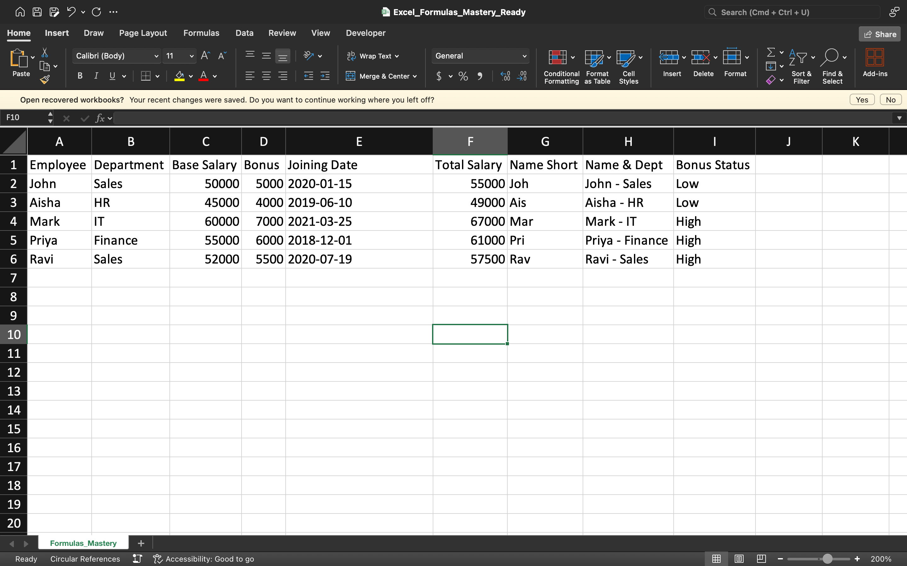

# Excel Formulas Mastery

This project demonstrates the use of essential Excel formulas as part of my Data Analyst learning journey.

## 📌 Functions Used
- **Mathematical:** `SUM`, `AVERAGE`, `ROUND`
- **Text:** `LEFT`, `RIGHT`, `CONCAT`
- **Logical:** `IF`, `AND`, `OR`
- **Lookup:** `VLOOKUP`, `INDEX-MATCH`, `XLOOKUP`

## 📂 Files Included
- `Excel_Formulas_Mastery_Ready.xlsx` – Fully worked example with formulas applied.

## 📷 Preview

## 🏆 Skills Learned
- Applying and combining different Excel functions
- Data formatting and organization
- Using lookup functions for data retrieval
